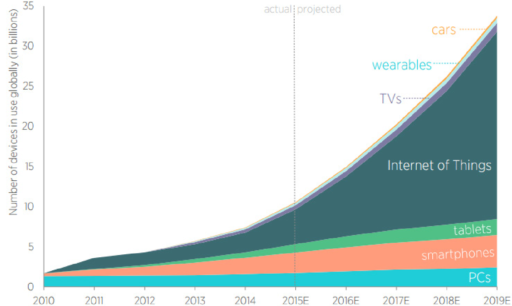
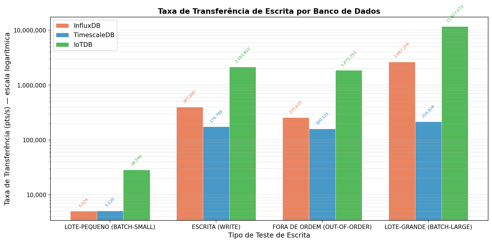
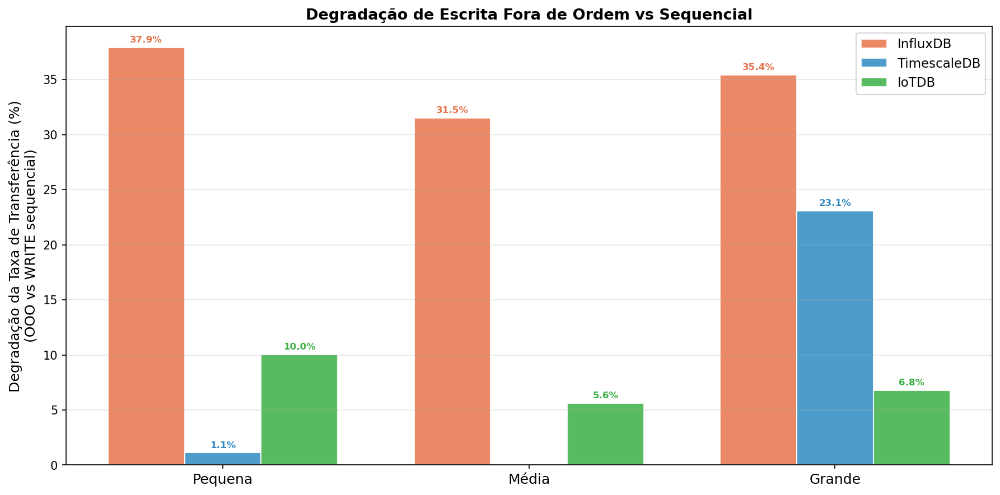
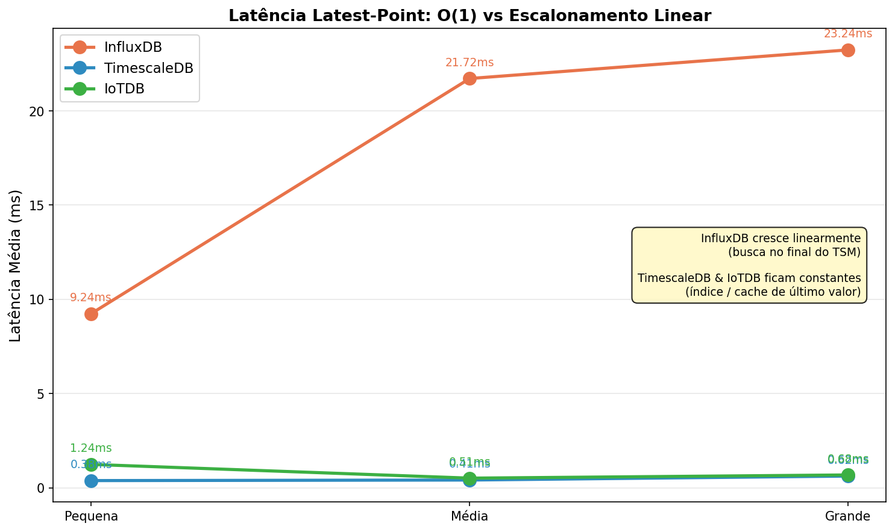
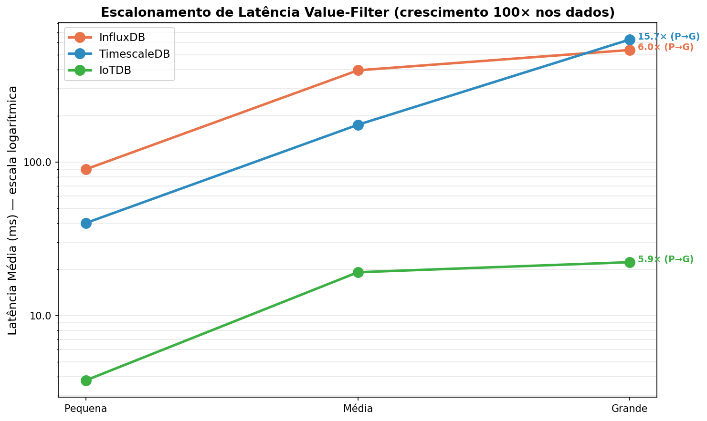
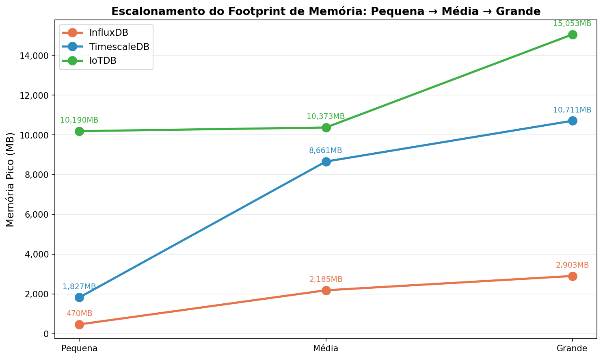
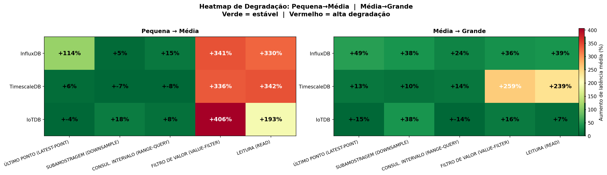
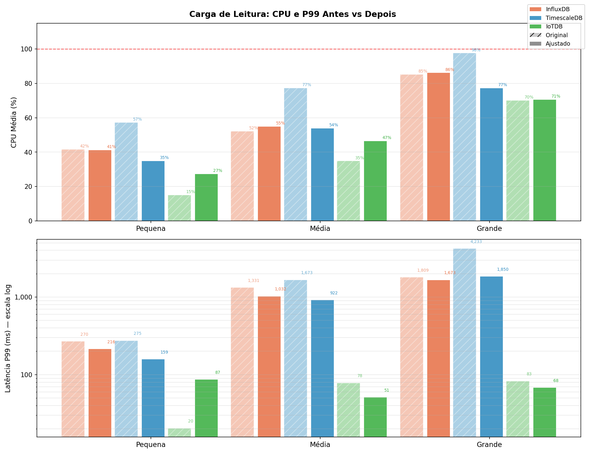

# Uma Análise Comparativa Reprodutível de Apache IoTDB, InfluxDB e TimescaleDB para Cargas de Trabalho IoT

Slides para defesa do TCC2 — 20 a 30 minutos
Formato sugerido: Marp / Reveal.js / PowerPoint
Imagens em: `../tcc2-latex/figures/pt_br/`
Designs em: https://getdesign.md/

---

## Slide 1 — Capa
*[~1 min]*

**Título:** Uma Análise Comparativa Reprodutível de Apache IoTDB, InfluxDB e TimescaleDB para Cargas de Trabalho IoT

- Luiz Fernando Klein
- Curso de Ciência da Computação — UFFS
- Chapecó, 2026
- Orientador: Prof. Dr. Geomar André Schreiner

---

## Slide 2 — Agenda
*[~0.5 min]*

1. Introdução
2. Fundamentação Teórica
3. Trabalhos Relacionados
4. Metodologia
5. Experimentos
6. Conclusão

---

# INTRODUÇÃO

---

## Slide 3 — Motivação: Explosão IoT
*[~1 min]*

- Cisco projeta 500 bilhões de dispositivos conectados à IoT até 2030
- 90% dos veículos conectados, 15 dispositivos por pessoa (Telefonica)
- Saúde inteligente, cidades inteligentes, IoT industrial: todos geram fluxos contínuos de medições

> O que costumava ser coletado em 10 minutos para sistemas muito ativos é agora gerado a cada segundo.



---

## Slide 4 — Dados Temporais e Limitações do Modelo Relacional
*[~1 min]*

**Séries temporais:** sequências de valores indexados por tempo, frequentemente com precisão de milissegundos

Limitações dos SGBDs relacionais nesse contexto:
- Indexação ineficiente para padrões de acesso temporal
- Alto custo de armazenamento histórico de longo prazo
- Ausência de funções temporais nativas (retenção, subamostragem, compressão)

**Resposta:** Bancos de Dados de Séries Temporais (BDSTs) — projetados desde a concepção para dados temporais

---

## Slide 5 — Os Três Bancos Avaliados
*[~1.5 min]*

| Banco | Arquitetura central | Origem |
|-------|---------------------|--------|
| **Apache IoTDB 1.3** | TsFile colunar + Thrift RPC | IoT industrial (Tsinghua) |
| **InfluxDB 2.7** | TSM (Time-Structured Merge Tree) + HTTP | Padrão de referência na literatura |
| **TimescaleDB (PG 15)** | Hipertabelas sobre PostgreSQL + WAL | SQL completo + ecossistema relacional |

**Critério de seleção:** presença na literatura recente

- InfluxDB: presente em 4 dos 6 estudos revisados
- IoTDB: lidera nos 2 estudos mais recentes (2023)
- TimescaleDB: presente em 4 dos 6 estudos revisados

Cada banco representa uma abordagem arquitetural distinta para o mesmo problema.

---

## Slide 6 — Lacuna de Reprodutibilidade
*[~1 min]*

**6 estudos comparativos de desempenho** revisados (2017–2024)

| Reprodutibilidade | Estudos |
|-------------------|---------|
| Total | **1** (Pereira 2023) |
| Parcial | 2 |
| Nenhuma | 3 |

**Consequências:**
- Resultados não podem ser validados de forma independente
- Impossível comparar descobertas entre estudos
- Experimentos não se adaptam a novo hardware ou versões de software

Este trabalho trata reprodutibilidade como prioridade de projeto: todo o ambiente está publicamente disponível.

---

## Slide 7 — Escopo: 9 Padrões × 3 Escalas × Isolamento
*[~1 min]*

**9 tipos de carga de trabalho:**
- 4 testes de escrita (sequencial, fora de ordem, lote=1, lote=1000)
- 5 testes de leitura (último valor, subamostragem, intervalo, filtro de valor, mista)

**3 escalas de volume** com variação de ~100x entre pequena e grande

**Isolamento sequencial de contêineres:** apenas um banco ativo por vez

> O isolamento não foi uma escolha de conveniência — foi descoberto como pré-requisito para resultados válidos após as execuções iniciais produzirem conclusões enganosas.

---

# FUNDAMENTAÇÃO TEÓRICA

---

## Slide 8 — Bancos de Dados e Sistemas Distribuídos
*[~1 min]*

**Bancos de Dados**
- SGBD: armazenamento e recuperação eficientes de grandes coleções de dados (Ramakrishnan 2003)
- Modelo relacional: tabelas, esquemas, integridade referencial, SQL
- Independência de dados, acesso concorrente seguro e recuperação de falhas

**Bancos de Dados Distribuídos**
- Múltiplos nós com bancos locais e esquema comum (Özsu 2011)
- Vantagem: localidade de dados e paralelismo entre nós
- Desafio: consistência da replicação vs. desempenho

---

## Slide 10 — Arquiteturas dos Três Bancos
*[~1.5 min]*

| Banco | Escrita | Leitura | Durabilidade |
|-------|---------|---------|--------------|
| **IoTDB** | Memtable JVM + flush assíncrono para TsFile colunar via Thrift RPC | Estatísticas min/max por bloco habilitam eliminação de blocos | Diferida (reconhece antes do disco) |
| **InfluxDB** | Cache TSM em memória + compactação para arquivos imutáveis via HTTP | TSI (Índice de Séries Temporais); sem atalho para último valor | Diferida (cache TSM) |
| **TimescaleDB** | Pilha PostgreSQL completa: TCP + SQL + WAL + MVCC via JDBC | Eliminação de blocos de hipertabela por tempo; B-tree/BRIN | Síncrona (WAL antes do ACK) |

Trade-off central: **durabilidade diferida = maior vazão; WAL síncrono = garantia forte, menor vazão**

---

## Slide 11 — Benchmarks: Princípios e Armadilhas
*[~1 min]*

Um bom benchmark deve ter: **portabilidade, clareza e escalabilidade** (Ramakrishnan 2003)

**5 armadilhas recorrentes** (Shapira 2016):
1. Comparar configurações que diferem em múltiplos parâmetros simultaneamente
2. Testar em escala insuficiente e extrapolar os resultados
3. Aceitar resultados suspeitos sem questionar a origem
4. Usar cargas de trabalho artificiais desconectadas do uso real
5. Comunicar resultados de forma incompleta

**Reprodutibilidade e isolamento:** executar múltiplos motores simultaneamente introduz artefatos de contenção de cache e CPU que podem inverter conclusões — demonstrado experimentalmente neste trabalho.

---

# TRABALHOS RELACIONADOS

---

## Slide 12 — Processo de Pesquisa
*[~1 min]*

**Busca:** palavras-chave "data streaming", "timeseries", "timeseries databases" — ordenados por citações

23 resultados lidos → 7 selecionados para análise detalhada

**3 categorias de análise:**

- **Funcionalidade** (1 trabalho): Petre 2019 — modelo de maturidade de 6 BDSTs, 18 atributos
- **Desempenho** (6 trabalhos): benchmarks controlados ou comparações em cenários reais
  - Lima 2024, Shah 2022, Naqvi 2017, Grzesik 2020, Pereira 2023, Wang 2023
- **Comparativa:** síntese dos 6 estudos de desempenho na tabela a seguir

---

## Slide 13 — Tabela Comparativa dos Estudos
*[~1.5 min]*

| Autor | Ano | Reprodutibilidade | Ferramentas | Líder |
|-------|-----|-------------------|-------------|-------|
| Lima | 2024 | Parcial | Apache JMeter | InfluxDB |
| Pereira | 2023 | **Total** | MulletBench, Ansible, Docker | IoTDB |
| Wang | 2023 | Parcial | TSBS | IoTDB |
| Shah | 2022 | Nenhuma | Python timeseries-generator | InfluxDB |
| Grzesik | 2020 | Nenhuma | Manual | PostgreSQL |
| Naqvi | 2017 | Nenhuma | Telegraf, Kapacitor | InfluxDB |

**Padrão temporal:** IoTDB lidera nos 2 mais recentes; InfluxDB nos 3 anteriores.

**3 lacunas identificadas:** (1) apenas 1/6 totalmente reprodutível; (2) sem benchmark controlado com IoTDB + InfluxDB + TimescaleDB juntos; (3) sem análise de como escolhas metodológicas afetam conclusões.

---

# METODOLOGIA

---

## Slide 14 — Objetivo Metodológico
*[~0.5 min]*

**Objetivo central:** caracterizar quais compromissos arquiteturais favorecem quais perfis de aplicação IoT

Duas prioridades de projeto:
1. **Medição de desempenho** — vazão, latência, consumo de recursos em 9 padrões × 3 escalas
2. **Reprodutibilidade** — cada componente tem versão fixada e está publicamente disponível

A metodologia foi projetada para isolar propriedades arquiteturais de artefatos de medição.

---

## Slide 15 — Infraestrutura Reprodutível
*[~1.5 min]*

**Docker Compose** com versões de imagem fixadas:
- `apache/iotdb:1.3.0-standalone`, `influxdb:2.7-alpine`, `timescale/timescaledb:latest-pg15`
- Contêineres iniciados e parados sequencialmente — apenas um ativo por vez

**Nix flake** — ambiente declarativo com lock fixado:
- Java 17, Maven, Python 3, Docker com todas as dependências transitivas versionadas
- `nix develop` garante ambiente idêntico em qualquer máquina Linux

**Python CLI** (`benchmark.py`) — orquestra os 27 testes:

```
python3 benchmark.py --scale large
```

**Repositório público:** `github.com/LuizFerK/iot-benchrunner`

---

## Slide 16 — Ferramenta: iot-benchmark
*[~1.5 min]*

**Por que iot-benchmark?**

Suporte nativo aos 3 bancos nos seus protocolos corretos:
- IoTDB: Session API Thrift RPC (modo SESSION\_BY\_TABLET)
- InfluxDB: protocolo de linha HTTP
- TimescaleDB: conexão JDBC

Fundamentado no **YCSB** (Yahoo! Cloud Serving Benchmark), adaptado ao contexto de séries temporais IoT.

**Alternativas avaliadas e rejeitadas:**
- **TSBS** (Time Series Benchmark Suite): framework maduro, mas sem suporte ao IoTDB
- **Apache JMeter** (usado em Lima 2024): lida bem com HTTP, mas requer scripts personalizados para Thrift e JDBC, introduzindo sobrecarga específica da ferramenta

**Saídas da ferramenta:**
- Matriz de Resultado: operações totais, tempo decorrido, vazão (pts/s)
- Matriz de Latência: média, mínima, máxima e P99 por tipo de operação

---

## Slide 17 — 9 Cargas de Trabalho e Rationale
*[~2 min]*

**Escrita (4):**

| Carga | Rationale |
|-------|-----------|
| `write` | Ingestão sequencial ordenada — linha de base de vazão bruta |
| `out-of-order` | 20% dos pontos atrasados (Poisson) — simula sensores IoT sobre redes celulares/LPWAN |
| `batch-small` (LOTE=1) | Isola sobrecarga de protocolo por requisição |
| `batch-large` (LOTE=1000) | Teto prático de eficiência em carregamento em lote |

**Leitura (5):**

| Carga | Rationale |
|-------|-----------|
| `latest-point` | Estado atual do sensor — padrão fundamental de monitoramento |
| `downsample` | GROUP BY por janela de tempo — painel de análise |
| `range-query` | Todos os pontos em janela — exportação histórica, retraining |
| `value-filter` | Predicado sobre valores (`temp > 85`) — alertas por limiar; mais discriminatório arquiteturalmente |
| `read` | Todos os 10 tipos com peso igual — linha de base mista |

---

## Slide 18 — Escalas e Métricas
*[~1.5 min]*

**Escalas de volume (~100x de variação entre pequena e grande):**

| Escala | Clientes | Dispositivos | Sensores | Laços | Dados totais |
|--------|----------|--------------|----------|-------|--------------|
| Pequena | 5 | 10 | 10 | 1.000 | ~50 k pts |
| Média | 5 | 10 | 10 | 5.000 | ~250 k pts |
| Grande | 10 | 50 | 20 | 5.000 | ~5 M pts |

**Métricas coletadas por execução:**
- Vazão (pts/s) — primária para escrita
- Latência média e **P99** (ms) — primária para leitura; P99 captura comportamento de cauda
- CPU média/pico (%) e Memória média/pico (MB) via `docker stats`

> Latência é a métrica primária de leitura: a vazão pts/s não é comparável entre tipos de consulta (uma consulta de intervalo retorna centenas de pontos; uma de último valor retorna exatamente um).

---

## Slide 19 — Ajustes de Configuração e Isolamento
*[~1.5 min]*

Duas melhorias aplicadas antes das reexecuções finais:

**1. Ciclo de vida sequencial de contêineres**
- Configuração original: todos os 3 contêineres ativos simultaneamente
- Contêineres ociosos competiam por cache de páginas do SO e CPU
- Corrigido: cada banco sobe imediatamente antes dos seus testes e para logo após

**2. Ajuste no nível do banco**
- **TimescaleDB:** pgtune para PostgreSQL 15 (`shared_buffers=8GB`, `work_mem=27413kB`, `checkpoint_completion_target=0.9`)
- **InfluxDB:** cache TSM elevado de 1 GB para 8 GB — padrão conservador original

Configurações padrão do PostgreSQL são intencionalmente conservadoras para hardware de baixo recurso. Reportar sem ajuste seria reportar desempenho abaixo do esperado para produção.

Resultados originais e ajustados são reportados e comparados na escala pequena.

---

# EXPERIMENTOS

---

## Slide 20 — Ambiente de Teste
*[~0.5 min]*

| Componente | Detalhes |
|------------|----------|
| CPU | Intel Core i5-11400F (6c/12t, 2,60–4,40 GHz) |
| RAM | 32 GB DDR4 |
| Disco | 500 GB NVMe SSD |
| SO | NixOS (Linux 6.12) |

**Nota sobre CPU:** o `docker stats` reporta em porcentagem de 1 núcleo lógico. 600% = todos os 6 núcleos saturados. Valores por banco na faixa de 20–100% indicam carga dentro do orçamento computacional disponível.

---

## Slide 21 — Exemplo: Escrita de Linha de Base (Escala Pequena)
*[~1 min]*

| Banco | pts/s | Lat. Média | Lat. P99 | CPU Média |
|-------|-------|-----------|----------|-----------|
| **IoTDB** | 2.163.809 | 1,73 ms | 1,18 ms | 5,1% |
| **InfluxDB** | 397.894 | 12,00 ms | 190,50 ms | 8,5% |
| **TimescaleDB** | 174.787 | 27,70 ms | 223,00 ms | 22,5% |

IoTDB: ~5x o InfluxDB e ~12x o TimescaleDB em vazão de escrita sequencial.

Causas arquiteturais cumulativas:
- Profundidade de protocolo (Thrift binário colunar < HTTP < pilha PostgreSQL)
- Buffering assíncrono (IoTDB/InfluxDB) vs. WAL síncrono (TimescaleDB)
- Sem manutenção de índice síncrona no caminho de escrita do IoTDB

---

## Slide 22 — Resultados de Escrita: Sensibilidade ao Lote
*[~1.5 min]*

**Razão de aceleração LOTE=1 → LOTE=1000 (escala pequena):**

| Banco | LOTE=1 | LOTE=1000 | Razão |
|-------|--------|-----------|-------|
| IoTDB | 28.593 | 11.827.572 | 413x |
| InfluxDB | 5.024 | 2.667.256 | 531x |
| TimescaleDB | 5.120 | 214.927 | 42x |

IoTDB e InfluxDB: alta sensibilidade ao lote — custo fixo por requisição domina no LOTE=1.

TimescaleDB: razão menor (42x) porque o flush do WAL já domina no LOTE=1 — o gargalo passa de protocolo para I/O de armazenamento.

**Implicação prática:** para InfluxDB, bufferizar escritas localmente e enviar em lote é a otimização de maior impacto disponível (531x de diferença).



---

## Slide 23 — Escrita Fora de Ordem
*[~1.5 min]*

20% dos pontos chegam com atraso distribuído por Poisson (simula sensores LPWAN/celular)

| Banco | Escrita (pts/s) | Fora de Ordem (pts/s) | Penalidade |
|-------|----------------|----------------------|------------|
| TimescaleDB | 174.787 | 160.121 | -8,4% |
| IoTDB | 2.163.809 | 1.871.351 | -13,5% |
| InfluxDB | 397.894 | 255.634 | -35,7% |

Duas dimensões que convém analisar separadamente:
- **Tolerância relativa:** TimescaleDB mais resiliente (B-tree independe de ordem de inserção)
- **Vazão absoluta fora de ordem:** IoTDB ainda lidera amplamente (1,87 M vs. 255 K pts/s)



---

## Slide 24 — Leitura: Último Valor e Subamostragem
*[~2 min]*

**Último valor (ms) — menor é melhor:**

| Banco | Pequena | Média | Grande |
|-------|---------|-------|--------|
| TimescaleDB | 0,38 | 0,41 | 0,62 |
| IoTDB | 1,24 | 0,51 | 0,68 |
| InfluxDB | 9,24 | 21,72 | 23,24 |

TimescaleDB: varredura B-tree reversa toca apenas o bloco mais recente, independente do volume total. IoTDB: cache de último valor em memória por série. InfluxDB: busca em todos os arquivos TSM — cresce linearmente com os dados acumulados.

**Subamostragem (ms):**

| Banco | Pequena | Média | Grande |
|-------|---------|-------|--------|
| TimescaleDB | 0,61 | 0,52 | 0,73 |
| IoTDB | 1,81 | 0,64 | 0,95 |
| InfluxDB | 5,71 | 5,65 | 9,22 |

TimescaleDB: `time_bucket()` com eliminação de blocos — latência constante em todas as escalas. IoTDB melhora da pequena para média: JIT da JVM otimizando o caminho quente de agregação.



---

## Slide 25 — Leitura: Filtro de Valor e Intervalo
*[~2 min]*

**Filtro de valor — o mais discriminatório arquiteturalmente** (não pode ser respondido por índice de tempo)

| Banco | Pequena | Grande | Razão P→G |
|-------|---------|--------|-----------|
| IoTDB | 3,72 ms | 19,42 ms | 5,2x |
| InfluxDB | 71,09 ms | 496,81 ms | 7,0x |
| TimescaleDB | 23,98 ms | 510,05 ms | 21,3x |

IoTDB: estatísticas min/max por bloco TsFile eliminam blocos inteiros — crescimento sublinear (5,2x para 100x mais dados). Vantagem cresce com o volume.

TimescaleDB: BRIN com granularidade mais grossa — degrada superlinearmente (21,3x). Na escala grande: 26x mais lento que IoTDB.

**Intervalo de tempo:** TimescaleDB mais rápido (0,54 ms → 0,66 ms); IoTDB estável (1,19–1,21 ms); InfluxDB mais lento (5,41–8,68 ms).



---

## Slide 26 — Footprint de Memória
*[~1.5 min]*

| Banco | Início | Estável (escala média) | Pico (escala grande) |
|-------|--------|----------------------|----------------------|
| IoTDB | ~1,7 GB | ~10 GB | ~15 GB |
| InfluxDB | ~190 MB | ~940 MB | 2,9 GB (batch-large) |
| TimescaleDB | ~239 MB | ~1,8 GB | ~1,8 GB |

**IoTDB:** heap JVM pré-alocado; requer comprometimento substancial de RAM. O alto footprint é o custo da vazão de escrita dominante.

**InfluxDB:** mais eficiente — sem pré-alocação JVM, cache TSM limitado. Pico no batch-large da escala grande (buffers de compactação concorrente).

**TimescaleDB:** `shared_buffers` cresce com os dados em cache.

**Implicação:** gateways de borda IoT ou instâncias com RAM restrita favorecem InfluxDB mesmo quando a escrita é a prioridade.



---

## Slide 27 — Efeitos de Escala
*[~2 min]*

**Vazão de escrita por escala (pts/s):**

| Banco | Pequena | Média | Grande |
|-------|---------|-------|--------|
| IoTDB | 2.163.809 | 7.991.224 | 23.607.475 |
| InfluxDB | 397.894 | 392.975 | 1.256.602 |
| TimescaleDB | 174.787 | 175.685 | 400.455 |

IoTDB escala superlinearmente — efeito de aquecimento JIT da JVM: execuções mais longas dão ao JIT tempo para otimizar o caminho quente Thrift. O valor na escala grande (23,6 M pts/s) é o mais representativo de produção.

**Timeout do TimescaleDB (batch-large, escala grande):** o teste esgota os 3.600 s em ambas as execuções. Com 50 dispositivos × LOTE=1000, cada requisição toca 50 partições de hipertabela e dispara até 50 flushes WAL simultâneos. É o comportamento esperado sob alto fan-out de partições — convém considerar no dimensionamento.

**InfluxDB — último valor cresce linearmente com o volume:** estrutural, independe de ajuste. Implantações sem política de retenção verão esse custo crescer indefinidamente.



---

## Slide 28 — Impacto dos Ajustes e Falsos Positivos
*[~2.5 min]*

**Ganhos com ajuste de configuração (escala pequena):**

TimescaleDB (pgtune):
- Escrita: +30% vazão, -25% latência (`shared_buffers=8GB`)
- Filtro de valor: -40% latência (`work_mem` elimina ordenação em disco)
- P99 batch-large: 1.069 ms → 812 ms (`checkpoint_completion_target=0.9`)

InfluxDB (apenas isolamento, sem mudança de config):
- Latências de leitura: -15–21%
- P99 batch-large: 205 ms → 60 ms (-71%) — TimescaleDB concorrente privava o motor TSM de largura de banda de I/O

**Dois falsos positivos revertidos na escala grande:**

| Resultado original | Reexecução isolada | Causa |
|--------------------|-------------------|-------|
| Penalidade OOO TimescaleDB: **23%** | **2,7%** | Cache frio por expansão do heap JVM do IoTDB |
| Saturação CPU TimescaleDB: **97,7%** / P99 4.232 ms | **77,4%** / P99 1.850 ms | 3 bancos + cliente disputando os mesmos 6 núcleos |

Sem ciclos de vida sequenciais e ajuste padrão, ambas as afirmações teriam sido publicadas como descobertas validadas.



---

# CONCLUSÃO

---

## Slide 29 — Achados Principais
*[~2 min]*

**1. Arquiteturas determinam o comportamento de escalonamento, não o ajuste de configuração**
- Vantagem de filtro de valor do IoTDB cresce estruturalmente com o volume (estatísticas min/max)
- Latência de último valor do InfluxDB cresce linearmente (sem atalho TSM para última entrada)
- Subamostragem do TimescaleDB permanece constante (eliminação de blocos por intervalo)

**2. Nenhum dos três bancos se destaca em todas as cargas de trabalho**

| Cenário | Banco recomendado |
|---------|-------------------|
| Ingestão IoT dominada por escrita com RAM suficiente | IoTDB |
| Alertas por limiar sobre histórico crescente | IoTDB (filtro sublinear) |
| Painéis com janelas de tempo recentes | TimescaleDB |
| Exportação histórica, consultas de intervalo | TimescaleDB |
| SQL, joins relacionais, ecossistema PostgreSQL | TimescaleDB |
| Memória restrita, volume moderado, carga mista | InfluxDB |

**3. Isolamento de recursos é pré-requisito para benchmark válido**
- Dois falsos positivos revertidos por reexecuções isoladas demonstram isso empiricamente

---

## Slide 30 — Limitações e Trabalhos Futuros
*[~1 min]*

**Limitações:**
- Implantação em nó único — não captura sobrecarga real de rede distribuída
- Testes de leitura sequenciais — cache de páginas aquecido favorece testes posteriores
- IoTDB: reconhecimento em memória antes da persistência em disco (durabilidade diferida)
- Aquecimento da JVM: benchmarks curtos subestimam a vazão em estado estacionário do IoTDB

**Trabalhos futuros:**
- Implantações distribuídas (IoTDB multi-nó, InfluxDB Clustered, TimescaleDB + Citus)
- Datasets industriais reais em escala de bilhões de pontos (telemetria veicular, redes elétricas)
- Custo de replicação e failover para decisões de implantação em produção
- InfluxDB 3.0 (novo motor colunar Arrow/DataFusion) — mudança arquitetural relevante

---

## Slide 31 — Obrigado
*[Perguntas]*

**Uma Análise Comparativa Reprodutível de Apache IoTDB, InfluxDB e TimescaleDB para Cargas de Trabalho IoT**

Luiz Fernando Klein — UFFS, 2026

Repositório público: `github.com/LuizFerK/iot-benchrunner`

Scripts de orquestração, configurações Docker, ambiente Nix e dados de resultados disponíveis para replicação.

*Perguntas?*
